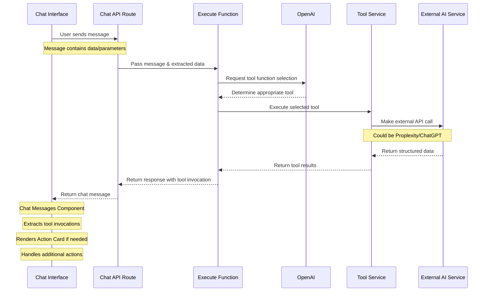

## Flow Description

1. **Initial Flow**

   - User interacts with Chat Interface
   - Message is appended and sent to Chat API
   - Message data is extracted in API route

2. **Execution Flow**

   - Execute function receives message and data
   - OpenAI determines appropriate tool function
   - Selected tool is executed

3. **External Service Integration**

   - Tool service makes external API calls
   - Communicates with services like Proplexity/ChatGPT
   - Handles person data fetching and system prompts
   - Returns structured data

4. **Response Flow**
   - Tool invocation results return through the chain
   - Chat messages component receives response
   - Handles tool invocations and renders action cards
   - Manages additional actions as needed

## Key Components

- **Chat Interface**: Handles user interaction and message display
- **Chat API Route**: Processes messages and manages data flow
- **Execute Function**: Coordinates tool selection and execution
- **Tool Service**: Interfaces with external APIs and services
- **External AI Service**: Provides AI capabilities (Proplexity/ChatGPT)
- **Action Cards**: UI components for tool invocation results
