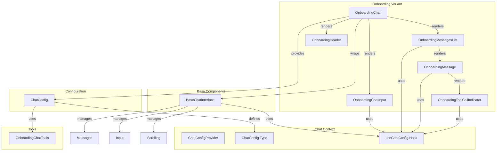

```mermaid
graph TD
subgraph "Chat Context"
CC[ChatConfigProvider]
CCT[ChatConfig Type]
CCH[useChatConfig Hook]
end

    subgraph "Base Components"
        BCI[BaseChatInterface]
        BCI --> |uses| CCH
    end

    subgraph "Onboarding Variant"
        OC[OnboardingChat]
        OCI[OnboardingChatInput]
        OML[OnboardingMessagesList]
        OM[OnboardingMessage]
        OTI[OnboardingToolCallIndicator]
        OH[OnboardingHeader]
    end

    subgraph "Configuration"
        Config[ChatConfig]
        Config --> |defines| CCT
    end

    subgraph "Tools"
        OT[OnboardingChatTools]
        Config --> |uses| OT
    end

    %% Component Relationships
    OC --> |wraps| BCI
    OC --> |provides| Config
    OC --> |renders| OCI
    OC --> |renders| OML
    OC --> |renders| OH

    OML --> |renders| OM
    OM --> |renders| OTI

    %% Context Usage
    OCI --> |uses| CCH
    OML --> |uses| CCH
    OM --> |uses| CCH
    OTI --> |uses| CCH

    %% Data Flow
    BCI --> |manages| Messages
    BCI --> |manages| Input
    BCI --> |manages| Scrolling
```
