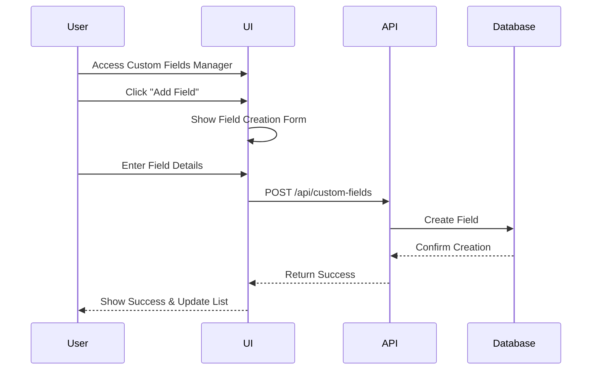
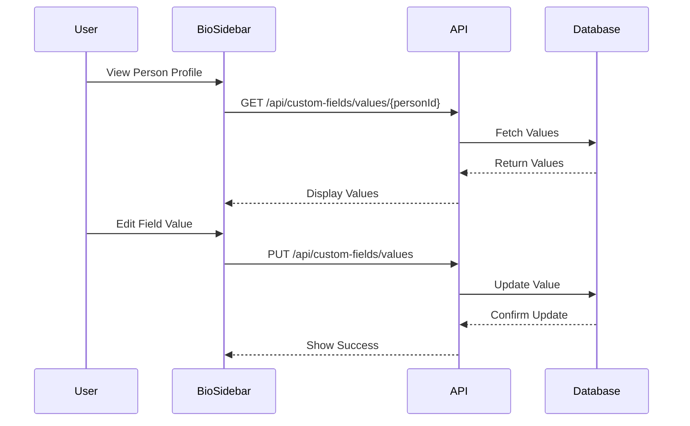

# Custom Fields Technical Requirements Document - Phase 1

## 1. Executive Summary

The custom fields feature enables users to create, manage, and utilize custom data fields that mirror their unique relationship management approaches. This feature is critical for supporting sophisticated relationship categorization, enabling future AI-powered suggestions, and providing flexibility in how users organize their network.

## 2. Problem Statement and Value Proposition

### Problem Statement

Currently, users are constrained by predefined fields such as birthdays, contact methods, addresses, and websites, limiting the ability to structure relationship data meaningfully. Users lack the capability to define relationships according to personal or organizational categorization methods, resulting in inefficient manual workarounds or external tracking systems.

Specifically, users need structured fields to capture:

- **Ecosystems** individuals belong to (industry, community, interests).
- **Role and position** within ecosystems (e.g., "connector," "influencer," "supporter").
- **Relationship Stage** (new, ongoing, supported, dormant).
- **Other organization-specific custom attributes** necessary for enriched relationship management.

By implementing custom fields, users can create richer, structured relationship data that integrates seamlessly into their workflows and supports advanced AI-driven suggestions and analytics.

This limitation impacts the system's ability to:

1. Provide meaningful relationship insights
2. Generate contextually relevant suggestions
3. Support organization-specific workflows
4. Enable sophisticated network analysis

### Strategic Alignment

This feature directly supports our core product vision of enabling sophisticated relationship management by:

1. Providing the foundation for AI-powered relationship insights
2. Enabling organizations to implement their relationship frameworks
3. Supporting future features such as:
   - Contextual content suggestions
   - Network diversity metrics
   - Relationship strength scoring
   - Custom workflow automation

### Impact of Non-Implementation

While the system would remain functional without custom fields, we would face significant limitations:

1. Reduced ability to provide contextual suggestions
2. Limited capacity for sophisticated network analysis
3. Decreased product differentiation
4. Lack of adoption / potential user churn due to inflexibility
5. Increased complexity in implementing future features that rely on structured relationship data

### User Stories (Phase 1)

Phase 1 specifically includes the following user stories:

- Create Custom Fields: Users can add new custom fields for persons and groups, specifying field type (text, date, checkbox, number, dropdown single-select, dropdown multi-select).
- Edit Field Name: Users can rename existing custom fields.
- Delete Custom Fields: Users can remove custom fields; values associated with these fields should also be deleted (cascaded).
- Reorder Custom Fields: Users can reorder custom fields via a drag-and-drop interface in the field management view.
- Manage Dropdown Options: Users can create, reorder, and manage options for dropdown fields (single/multi-select).
- Data Entry: Users can input and edit values into custom fields for each person or group.
- Field Display: Clearly display fields segmented by base native fields, organization-wide custom fields, and group-specific custom fields.

## 4. User Experience and Interface Design

### Interface Overview

Custom fields management will reside within an accessible settings view reachable via a three-dot ellipsis menu (`@group-header.tsx`). The primary management UI will appear in a settings page accessible through the group header dropdown (`@group-header.tsx`).

### Field Management UI

The interface (`src/components/settings/custom-fields/manager.tsx`) includes:

- **Field Creation Form:** Clearly prompts users to select a field type and enter a field name.
- **Drag-and-Drop Reordering:** Limited exclusively to the custom fields management view.
- **Dropdown & Multi-Select Options:** Users can manage (add, reorder, remove) options within dropdown fields.

### Display of Custom Fields (Person View)

Within the `@bio-sidebar.tsx`, fields are clearly organized and segmented as follows (top-down):

1. **Base Native Fields** (e.g., birthday, address)
2. **Organization-wide Custom Fields**
3. **Group-specific Custom Fields** (clearly labeled by the associated group)

This approach ensures clarity and ease of navigation, minimizing confusion.

## 4. User Interface Specifications

### Navigation & Access

Custom fields management will be accessible through two primary paths:

1. Global Custom Fields:

   - Access via Settings menu in the main navigation
   - Manages organization-wide custom fields for people and groups

2. Group-Specific Custom Fields:
   - Access via group settings (3-dot menu in group header)
   - Manages custom fields specific to that group

### UI Components

#### Custom Fields Management View

```typescript
// src/components/settings/custom-fields/manager.tsx
interface CustomFieldsManagerProps {
  entityType: 'person' | 'group';
  groupId?: string;
}
```

This view will include:

1. List of existing custom fields
2. Add new field button
3. Drag-and-drop reordering interface
4. Field type selection
5. Option management for dropdown/multi-select fields

#### Field Display in Bio Sidebar

The bio sidebar (`src/components/person/bio-sidebar.tsx`) will be enhanced to display custom fields in three distinct sections:

1. Base Fields (existing)
2. Organization-wide Custom Fields
3. Group-specific Custom Fields (with group labels)

```typescript
// src/components/person/custom-fields-section.tsx
interface CustomFieldsSectionProps {
  personId: string;
  groupId?: string;
  sectionType: 'organization' | 'group';
}
```

### User Flows

#### Creating a Custom Field



#### Editing Custom Field Values



## 5. Implementation Requirements

### Core Requirements

1. Field Types Support

   - Text (single line)
   - Number (integer and decimal)
   - Date (using our standard dateHandler)
   - Dropdown (single select)
   - Checkbox (boolean)
   - Multi-select (dropdown with multiple selectable options)

2. Field Management

   - Creation with name and type (and optionally dropdown options)
   - Editing of field name only
   - Deletion (with cascade)
   - Reordering via drag-and-drop (for select fields)
   - Option management for dropdowns

3. Value Management
   - Setting values for entities
   - Bulk updates
   - Validation per field type
   - History tracking

This should be possible at the individual person / user page. And at the person or groups list view if desired.

### Integration Requirements

1. AI Integration

   - Service methods must support AI agent operations
   - Tool definitions for field management
   - Context awareness for suggestions

2. Search Integration ( This is not required for phase 1)
   - Custom field values must be searchable
   - Filter support in list views
   - Sort support where applicable

### Performance Requirements

1. Loading Times (Not required for phase 1)

   - Field list: < 500ms
   - Value fetch: < 200ms
   - Updates: < 100ms

2. Scale Considerations (Not required for phase 1)
   - Support up to 100 custom fields per user
   - Up to 1000 options per dropdown field
   - Efficient handling of multi-select values

## 6. Testing Requirements

### Unit Tests

```typescript
// src/services/custom-fields/__tests__/create-custom-field.test.ts
describe('createCustomField', () => {
  describe('success cases', () => {
    it('creates a text field successfully');
    it('creates a dropdown field with options');
    it('handles empty options array');
  });

  describe('error cases', () => {
    it('handles duplicate field names');
    it('validates field types');
    it('validates option formats');
  });
});
```

### Integration Tests

1. API Route Testing

   - All CRUD operations
   - Authentication checks
   - Error handling

2. UI Component Testing
   - Field rendering
   - Value updates
   - Validation feedback

## 5. Activity Diagrams & Workflow

### Workflow: Managing Custom Fields

**Step-by-step interaction:**

1. User clicks the 3-dot ellipsis dropdown in the `@group-header.tsx` component.
2. User selects "Manage Custom Fields," navigating to the dedicated custom fields settings page.
3. User creates, edits, deletes, or reorders fields and saves changes.
4. On successful save, the system updates the field definitions (`custom_fields` table via the service layer).
5. Custom fields are immediately available in the `@bio-sidebar.tsx`.

### Workflow: Data Entry on Person Record

1. User opens a person's profile (`@bio-sidebar.tsx`).
2. User sees base fields, then organization-wide custom fields, followed by any applicable group-specific fields.
3. User inputs or edits data into custom fields.
4. Data updates are saved via API calls through service methods to ensure consistency.

## 3. Technical Architecture

### Database Schema

```sql
-- Custom Field Definitions
CREATE TABLE custom_fields (
    id UUID PRIMARY KEY DEFAULT uuid_generate_v4(),
    name VARCHAR(255) NOT NULL,
    field_type VARCHAR(50) NOT NULL,
    entity_type VARCHAR(50) NOT NULL, -- 'person' or 'group'
    group_id UUID NULL REFERENCES groups(id),
    display_order INTEGER NOT NULL,
    created_at TIMESTAMP WITH TIME ZONE DEFAULT CURRENT_TIMESTAMP,
    updated_at TIMESTAMP WITH TIME ZONE DEFAULT CURRENT_TIMESTAMP,
    user_id UUID NOT NULL REFERENCES auth.users(id),

    -- Ensure unique names per context
    UNIQUE (name, entity_type, group_id, user_id)
);

-- Custom Field Options (for dropdowns and multi-select)
CREATE TABLE custom_field_options (
    id UUID PRIMARY KEY DEFAULT uuid_generate_v4(),
    custom_field_id UUID NOT NULL REFERENCES custom_fields(id),
    value VARCHAR(255) NOT NULL,
    display_order INTEGER NOT NULL,
    created_at TIMESTAMP WITH TIME ZONE DEFAULT CURRENT_TIMESTAMP,
    updated_at TIMESTAMP WITH TIME ZONE DEFAULT CURRENT_TIMESTAMP,
    user_id UUID NOT NULL REFERENCES auth.users(id),

    -- Ensure unique values per field
    UNIQUE (custom_field_id, value)
);

-- Custom Field Values
CREATE TABLE custom_field_values (
    id UUID PRIMARY KEY DEFAULT uuid_generate_v4(),
    custom_field_id UUID NOT NULL REFERENCES custom_fields(id),
    entity_id UUID NOT NULL, -- References either person.id or group.id
    value TEXT NULL,
    created_at TIMESTAMP WITH TIME ZONE DEFAULT CURRENT_TIMESTAMP,
    updated_at TIMESTAMP WITH TIME ZONE DEFAULT CURRENT_TIMESTAMP,
    user_id UUID NOT NULL REFERENCES auth.users(id),

    -- Ensure one value per entity per field
    UNIQUE (custom_field_id, entity_id)
);

-- Triggers for updated_at
CREATE OR REPLACE FUNCTION update_updated_at_column()
RETURNS TRIGGER AS $$
BEGIN
    NEW.updated_at = CURRENT_TIMESTAMP;
    RETURN NEW;
END;
$$ language 'plpgsql';

CREATE TRIGGER update_custom_fields_updated_at
    BEFORE UPDATE ON custom_fields
    FOR EACH ROW
    EXECUTE FUNCTION update_updated_at_column();

CREATE TRIGGER update_custom_field_options_updated_at
    BEFORE UPDATE ON custom_field_options
    FOR EACH ROW
    EXECUTE FUNCTION update_updated_at_column();

CREATE TRIGGER update_custom_field_values_updated_at
    BEFORE UPDATE ON custom_field_values
    FOR EACH ROW
    EXECUTE FUNCTION update_updated_at_column();
```

### Row Level Security Policies

```sql
-- Custom Fields RLS
ALTER TABLE custom_fields ENABLE ROW LEVEL SECURITY;

CREATE POLICY "Users can view their own custom fields"
    ON custom_fields FOR SELECT
    USING (auth.uid() = user_id);

CREATE POLICY "Users can insert their own custom fields"
    ON custom_fields FOR INSERT
    WITH CHECK (auth.uid() = user_id);

CREATE POLICY "Users can update their own custom fields"
    ON custom_fields FOR UPDATE
    USING (auth.uid() = user_id);

CREATE POLICY "Users can delete their own custom fields"
    ON custom_fields FOR DELETE
    USING (auth.uid() = user_id);

-- Similar policies for custom_field_options and custom_field_values
```

### Service Layer Architecture

The custom fields feature will be implemented using our standard service-based architecture. All operations must go through service methods to ensure consistency and enable AI agent integration.

```typescript
// src/services/custom-fields/types.ts
export interface CustomField {
  id: string;
  name: string;
  fieldType: 'text' | 'number' | 'date' | 'dropdown' | 'checkbox' | 'multi-select';
  entityType: 'person' | 'group';
  groupId?: string;
  displayOrder: number;
  createdAt: Date;
  updatedAt: Date;
  createdBy: string;
}

export interface CustomFieldOption {
  id: string;
  customFieldId: string;
  value: string;
  displayOrder: number;
}

export interface CustomFieldValue {
  id: string;
  customFieldId: string;
  entityId: string;
  value: string | null;
}

// Service response types following our standard pattern
export type CreateCustomFieldResult = ServiceResponse<{
  field: CustomField;
  options?: CustomFieldOption[];
}>;

export type UpdateCustomFieldResult = ServiceResponse<{
  field: CustomField;
  options?: CustomFieldOption[];
}>;

export type DeleteCustomFieldResult = ServiceResponse<{
  success: boolean;
}>;
```

### API Routes

New API routes will be added to handle custom field operations:

```typescript
// src/app/api/custom-fields/route.ts
export async function GET(req: Request) {
  const { entityType, groupId } = await req.json();
  // Return fields for entity type and optional group
}

export async function POST(req: Request) {
  const { name, fieldType, entityType, groupId, options } = await req.json();
  // Create new custom field
}

// src/app/api/custom-fields/[id]/route.ts
export async function PUT(req: Request) {
  const { name, options } = await req.json();
  // Update existing custom field
}

export async function DELETE(req: Request) {
  // Delete custom field
}
```

## 6. Release Planning

### Phase 1 Rollout Strategy

1. Database Migration

   - Run schema updates
   - Create RLS policies
   - Add trigger functions

2. Service Layer

   - Implement core services
   - Add test coverage

3. UI Components

   - Build management interface
   - Update bio sidebar
   - Add field editors

4. Testing & QA
   - Unit test completion
   - Integration testing
   - Performance validation

## 7. Future Considerations

While out of scope for Phase 1, the following should be considered during implementation:

1. Field type conversion
2. Templated field sets
3. Conditional field visibility
4. Advanced validation rules
5. Automated value population
6. Field value analytics

### Backup & Recovery

1. Data Protection

   - Field definition backups
   - Value history
   - Restoration procedures

2. Error Recovery
   - Value conflict resolution
   - Option synchronization
   - Orphaned value cleanup

## 8. Success Metrics

### Technical Metrics

1. Performance

   - Load time < 500ms for field lists
   - Update latency < 100ms
   - Search response < 200ms

2. Reliability
   - 99.9% operation success rate
   - Zero data loss incidents
   - < 1% error rate

### User Success Metrics

1. Adoption

   - > 50% of users create custom fields
   - > 80% of custom fields have values
   - > 30% of users use advanced field types

2. Engagement
   - Regular field updates
   - Multiple field types used
   - Group-specific field creation

## 9. Dependencies

### External Dependencies

1. Database

   - Supabase custom field tables
   - RLS policy support
   - Trigger function capability

2. Frontend
   - React DnD for reordering
   - Date handling library
   - Form validation

### Internal Dependencies

1. Components

   - Bio sidebar integration
   - Group header menu
   - Settings interface

2. Services
   - Authentication
   - Group management
   - Person management

## 10. Risk Assessment

### Technical Risks

1. Performance

   - Large number of fields impact
   - Complex query performance
   - UI responsiveness

2. Data Integrity
   - Cascade deletion effects
   - Option synchronization
   - Value consistency

### Mitigation Strategies

1. Performance

   - Implement caching
   - Optimize queries
   - Lazy loading of values

2. Data Integrity
   - Transaction usage
   - Validation layers
   - Audit logging
