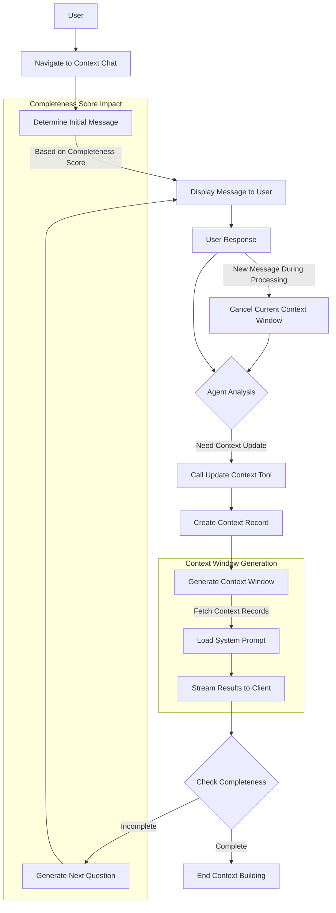

## Plan

Primary:

- [x] ~~_We'll create a new table called "user_profile" that will store the user's profile information. (This will need to be created on new-user-setup)_~~ [2025-02-23]
- [x] ~~_Create a new service to get the user_profile for the current user_~~ [2025-02-23]
- [x] ~~_Create the service tests for the context_summary generation_~~ [2025-02-24]
- [ ] Create a new chat interface for the goal planner (looks identical but differnet end point and tool calls)
- [ ] Create a new route for the goal planner
- [ ] Need to create a new page that will display the goal planner.
- [ ] Create a new goal planner agent and tool calls
- [ ] Create a new table for storing "user context" records ( we can have a "factored_in" attribute that will be a boolean for whether the context has been factored into the context summary). That way we're only grabbing net new additions to update the context window. i.e. changes over time. The content will be the { content and a reason }

Secondary:

- [ ] Create a new tool call to "update user context"

Tools:

- https://mdxeditor.dev/editor/docs/getting-started

(Prompt)
I want you to create a flow chart for the following flow and I want you to insert it at the bottom of the goal planning markdown. So the user will start by navigating to the context chat. The context chat will determine what the initial message should be. The user will respond to that message. The agent will then determine if it needs to call a particular tool. So for example, the update content. The tool will then create a new record related to the user context. Once that is complete, then the client will make a request to generate the user context window. If the user decides to make another message before the context window is complete then it will stop that context window's operations. Generating the user context window will require fetching the user context records and a core system prompt. It will stream the results to the client. The initial message will actually be a function of the user's completeness score that is generated by the user context window. The subsequent message that the chat is asking will also factor in this completeness score and the Goal-builder system prompt will have context on what that metric or value is.

### High Level Flow

The goal planning flow follows these key steps:

1. User navigates to context chat
2. System determines initial message based on completeness score
3. User responds and agent analyzes need for tool calls
4. Context updates are made and context window is generated
5. Process continues until completeness score reaches threshold

## Implementation Notes

1. **Completeness Score**

   - Drives initial message selection
   - Influences follow-up questions
   - Determines when context gathering is sufficient

2. **Context Window**

   - Asynchronous generation
   - Cancellable operation
   - Combines user context records with system prompt

3. **Tool Integration**

   - Update Context tool for recording user information
   - Potential for additional specialized tools
   - Atomic operations for context updates

4. **Message Flow**
   - Dynamic question generation
   - Context-aware responses
   - Interrupt handling for new messages

### UX Thoughts

- The system will also pick up on these little things as necessary and will update user context records accordingly.
- Needs to include what you're offering, your unique value prop, your "Why", your purpose, your vision, etc... ( maybe this can be a separate path?)
- Understanding the user's vision could also be a litmus test for bringing them on as a user / client

### Prompt Thoughts

- Should end by asking the user if they would like to add more details...
- Should be thorough and detailed. Leave no stone unturned.
- Needs to cover things like: goals, family, previous history, previous successes, aspirations, fears, desires, likes & dislikes, preferences, relationship status, basically the system wants to have context on everything... favorite books & books that you've read, skills, people you look up to, food preferences, messaging tone & style (pull from emails), etc...
- Can also include beliefs, values, future visions, expectations about the world, etc...

- This will not get built all in 1 stretch and may take time to build out, but is a "metric" that can be built out by adding more and more details.
- We also want a "completeness" score calculated based on answering particular sets of questions and covering a certain domain holistically
- The completeness score: 0 - 100:
- 0 - 25: we have the basics: name, age, location, basic goals, etc.
- 26 - 50: we've got more details: family, previous history, previous successes, relationship status, etc.
- 51 - 75: We're really getting into the details of who they are as a person, aspirations, fears, desires, likes & dislikes, preferences, etc.
- 76 - 100: We have a full psychographic profile of the user
- The completeness score will be used to determine what the initial message should be and what the subsequent messages should be.
- Low completeness scores should focus on priority 1 questions and high completeness scores should focus on priority 2 questions
- The purpose of gathering all this context is to tailor everything we do for the user: content suggestions, plan of action, network suggestions, events to attend, etc... Everything is tailored to the user's context in some way, shape, or form, and any suggestions can be referenced back to the context of the user.
- The questions should be asked socratically and in a way that is not overwhelming to the user.
- Ideally the questions are asked to help build the user's narrative and create a more complete picture of who they are as a person.
- The questions should be fun, creative, and engaging, and really make the user think. They should want to answer the questions.

### Prompt to build prompt

You are an expert in prompt building. I need a concise, but comprehensive prompt based on the below context.

I'm building a chat experience with the intention of Socratically prompting the user to ask questions to basically build a life profile for them to ultimately end up building a plan of action. The end result of this will end up being a plan that will be used for the Central AI to reference when making additional suggestions. So this step is actually the data and information collection step where in this conversation it will actually be gathering context about the user, Socratically asking the user questions about their life, their history, their accomplishments, etc. And we'll then call tools that will save that information into user context rows. So whenever net new information is introduced that is pertinent to any of those elements, it will add a new context record. There will also be a completeness score so that the chat will have context of how complete a user's profile is at a given point in time and then will ask questions about the user. The user will put in that information that will get saved and then it will generate a profile. So I just need two prompts. The first prompt being the prompt that will socratically ask questions that should have context about kind of how complete this user's profile is. So for example if they're just getting started then the value will be zero and it should ask questions to really establish kind of an initial baseline. If the number is higher, let's say it's 55, 75 for whatever reason, then additional context questions would be more nuanced or maybe less critical but more fine tuning so to speak. The second prompt will actually be the prompt that will then build a summary of all this information. So there's another layer which is the prompt will take as an input all of the user context rows and records that have been created through the conversation. And then create a summary of the basically a psychograph almost. You can think of it as a summary of that person's, their fears, their goals, their wants, etc. And I need a prompt that's able to take in that contextual information and then generate an output that is useful for the user to see. But then too, for the third prompt, which would then take that summary and then build an actionable plan for that user. Maybe this third prompt and the second prompt happen all in one step. I can let you decide on that one, but that's kind of what I'm trying to get at is the user has a conversation that gets saved. And then we end up generating a plan of action and a kind of summary of that person that they have that can be used for other contexts for example, if we know the user like's coffee, we can offer coffee suggestions in the future.

(plus all the stuff above)

- I could have the system "fetch" the score and "follow up" questions that should be asked on the score?
