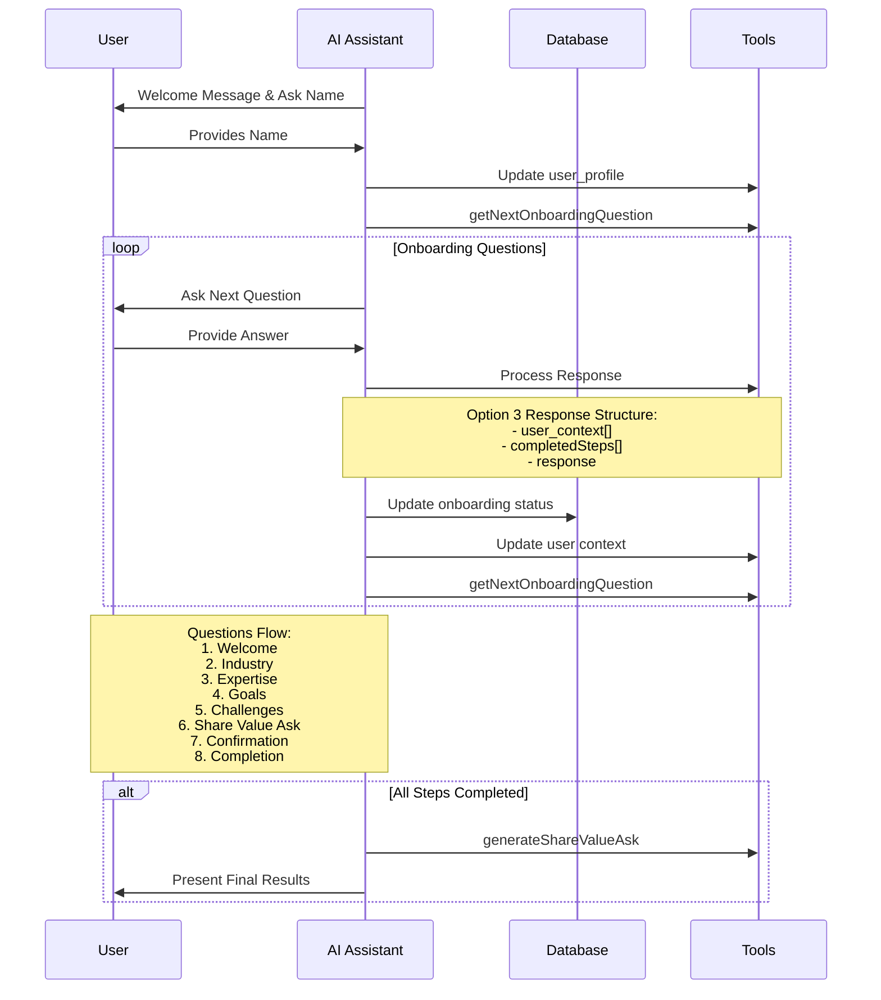

I think I could have an onboarding flow of a series of questions, and the AI can determine how many of the questions have been answered. It can pass multiple options as outputs from the answer in order to update / mark the question(s) as answered. "The gathering context part".

So the flow would be:

1. Welcome
2. Industry
3. Expertise
4. Goals
5. Challenges
6. Share Value Ask
7. Confirmation
8. Completion

The structure of the onboarding:

// This will be at the db level...

```
onboarding: {
  completed: false;
  currentStep: 'welcome';
  steps: {
    welcome: {
      completed: false;
      order: 1;
    }
    industry: {
      completed: true;
      order: 2;
    }
    expertise: {
      completed: true;
      order: 3;
    }
    goals: {
      completed: true;
      order: 4;
    }
  }
}
```

This object is restructured and then passed to the AI in the messages array so that the AI can determine the next question in the onboarding flow.

So the flow is:

Fetch object -> Determine if we just show the first question ( What is your name? Like claude )
( This updates the user_profile with the the user's name )

On input of the user's name, the AI will then respond back with the next question:

- This updates the user_profile with the the user's name
- Determine's what the user has mentioned / answered and outputs any "steps completed" (like E2B did in terms of structured outputs )
- Then it responds with the next question in the onboarding flow...

Welcome to Super Leader,

Name name is Super, and I'm an AI relationship builder, trained to help you build your network. ( workshop the copy )

To get started, we'll build out your personalized "Share Value Ask", your "Network Playbook", and a "Relationship Map" to help get you started. These will be used to customize everything you do in the app.

Before we get started, how would you like me to address you?

Then the user responds with their name.

The AI takes the name, grabs the user_profile tool and updates the name.
It should then also grab the

output:

```
{
"completedSteps": ["welcome", "shareValueAsk"],
"response": "Pleasure to meet you Cameron. Let's start with where you are today. What industry or role are you currently in?

You can also link your LinkedIn profile and I can pull in your details from there. (Version 2)"
}
```

From here, onFinish, we'll take the completedSteps and update the onboarding object. Then we'll take the updated onboarding object and pass it back to the AI?
We'll also call tools to update the "memory" of the user. (Update user_context tool call)

We can re-use our useChatInterface hook to handle the chat messages and saving... We'll save them as "onboarding" messages.

I can then grab all of the onboarding messages and then update the user_context after the fact?
I could also kick off a background job to do this?
"Showing updating memory..." multiple times may be a bit annoying, or it could reinforce the idea that the memory is being updated.

After the user responds... what will be AI and what will be API?

Response could always be the same with no tool calls?
Always show "updating memory..."? That might break the flow... I should just the AI figure it out...

Option 1:
If it's a user context update, update memory...
No matter what the user responds with, always call "getNextOnboardingQuestion" tool unless all the steps are completed, then we'll call the "generateShareValueAsk" tool.

This will take in the compeletedSteps and then determine the next question to ask. It will fetch the user's information... and we'll have to see 🤞 the "tool streaming" will work.

Because I will return back a streaming object...

Let's start with that...

Option 2: If that doesn't work... I can simply respond back, and then use the stored messages to create the context...

Option 3: Could also stream an object that's composed of and do it in one step?:

```
{
  "user_context": [
    {
      "content": "User is a relationship builder",
      "reason": "User mentioned they are a relationship builder"
    },
    {
      "content": "User is a real estate broker",
      "reason": "User mentioned they are a real estate broker"
    }
  ],
"completedSteps": ["welcome", "shareValueAsk"] | null,
"response": "Pleasure to meet you Cameron. Let's start with where you are today. What industry or role are you currently in?

You can also link your LinkedIn profile and I can pull in your details from there. (Version 2)"
}
```

This 3rd option is okay... having "user_context" would only allow 1 user context returned per repsonse, versus creating multiple... though are multiple necessary? We just need to make sure it's captured.

Once all the questions are answered, we'll call the "generateShareValueAsk" tool. This can only be called after all the steps are marked as completed, so we'll need to make sure that's passed in accordingly.



What are the key questions that we're going to be asking:

Idea: Where are you now? How did you get here? Where do you want to go?

1. What is your name?
2. How did you hear about me?
3. What's your story? How did you get here?
4. What are you doing now?
5. What do you find most challenging in your work?
6. Where are you happiest in your work?
7. What are you good at to support this vision?
8. What challenges are you
9. What's something you could talk about for hours?
10. What's your superpower?

### Categories of questions:

**Personal:**

- What city and state do you currently live in? ( timezone ) ( This will help us with reminders, finding local events, and local opportunities & people to connect with. )
- Do you have a family and children?

**Professional:**

- What inspired you to get into your current role?
- How much time do you currently spend engaging with your network?
- How do you currently engage with your network?

**Goals:**

- Where do you want to be in your career in the next 5 years? ( If they don't know, ask them about what skills they want to develop. )
- What skills do you want to develop over the next 5 years?
- What are you hoping to achieve with Superleader?
- Where are you along the path to your goals? What level of confidence do you have in your ability to achieve your goals? ( More confidence means less outreach, less confidence means more outreach & giving. )

**Values & Beliefs:**

- What is important to you in your life?
- Who are your role models? or folks that you look up to?
- If you could have dinner with anyone in the world, who would it be?
- What core values do you feel as though you live by?

**Fears & Challenges:**

- What do you find most challenging in your life or work?
- Where do you struggle to excel or naturally avoid?

**Strengths & Successes:**

- What are you most proud of?
- What are you most successful at?
- What activities do you find most rewarding?
- What do you think you're particularly good at or better than others?
- What do you think you do better than others?

- **Hobbies & Interests:**

- What organizations or groups are you a part of today? Think industry, government, volunteering, religion, hobbies etc...
- What types of activities do you enjoy?

# Share Value Ask:

Share: A little about myself, my beliefs, my goals, and my challenges.
Value: How I can be of help to other people:
Ask: What you could do for me

# Superleader Relationship Map: The people that we recommend to have in your network

- Ecosystems: Media, Finance, Government, Real Estate, Academia, Industry, Career, etc...
- The Range: Movers and shakers, influencers, decision makers, those getting started in their careers, etc...
- The Depth: The number of folks in each ecosystem
- The Roles of these folks and why they're important
- The geography of these folks ( We'll lean on being local to the user at first )

- Who are your mentors?

**UX Notes:**

-
- We'll probably want the user to be able to "modify" the Relationship Map to better fit their needs, so they can build their plan in a way that makes sense for them.
- We can probably get away with moving to the next step and say, "We can adjust this later"... kind of thing...

# SuperLeading Playbook:

Whether these folks are in your network or not, we'll provide you with a playbook on how to build a relationship with them.

- How you can provide value to these folks
- How you can access these folks ( events, etc... )
- Questions you can ask to build your relationships
- Ways you can be more useful
- The suggested amount of "outreach" you should be doing on a daily / weekly / monthly basis

## Playbook Breakdown:

- Opportunities: People & Events ( locally available )
- Value you can provide: Listening, Information, Introductions, Listening
- Outreach / Networking activities: ( Setup a suggested "goal" for the user to start with )
  - Daily: 10 new connections
  - Weekly: 10 new conversations
  - Monthly: 10 new introductions

( highlight what superleader can do to make this happen easier )

Next Steps:

- We'll import your contacts and connections and see how your current connections map to the suggested Relationship Map.

UX idea:

- How do we do the "progress bar"?
- We could actually display the "steps" or "percentage" of the profile process that we're going for?
- Just want to get to 50% for now?

```
{
  "completedSteps": [""],
  "response": "The XYZ industry provides a critical service to the community. What inspired you to participate in this industry?",
  "nextQuestion": "What industry are you currently in?" ( Should "embed" some context about the question so the user knows why it's being asked. ) ( Question should also include any information that's already been provided if relevant. )
}
```

Question: Do I ask the questions based on "categories" or relative to the user's completeness score?

Could do a "required questions" section and then a free form "completeness score" based set of questions...

Idea:

- I need to know the following:
- Where you live
- What you do
- What you're looking for
- What you're good at
- What ecosystems you're a part of
- What value you can provide to others ( hosting, information, introductions, dinners, )
