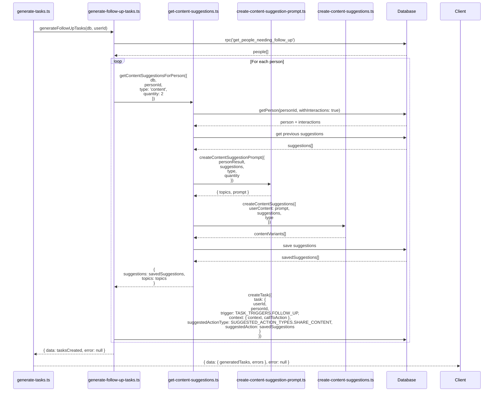
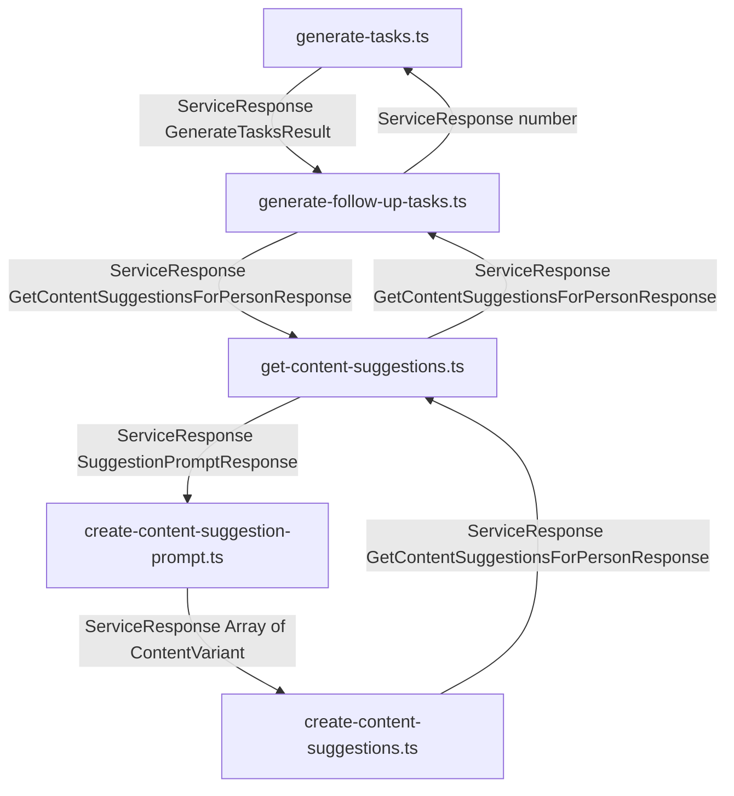

# Task Generation and Content Suggestion Data Flow



## Type Flow



## Type Definitions

### generate-tasks.ts

```typescript
interface GenerateTasksResult {
  generatedTasks: number;
  errors: string[];
}
```

### generate-follow-up-tasks.ts

```typescript
interface GetContentSuggestionsForPersonResponse {
  suggestions: ContentSuggestionWithId[];
  topics: string[];
}
```

### get-content-suggestions.ts

```typescript
interface ContentSuggestionWithId {
  id: string;
  contentUrl: string;
  title: string;
  reason: string;
}
```

### create-content-suggestion-prompt.ts

```typescript
interface SuggestionPromptResponse {
  topics: string[];
  prompt: string;
}
```

### create-content-suggestions.ts

```typescript
interface ContentVariant {
  title: string;
  contentUrl: string;
  reason: string;
}
```
