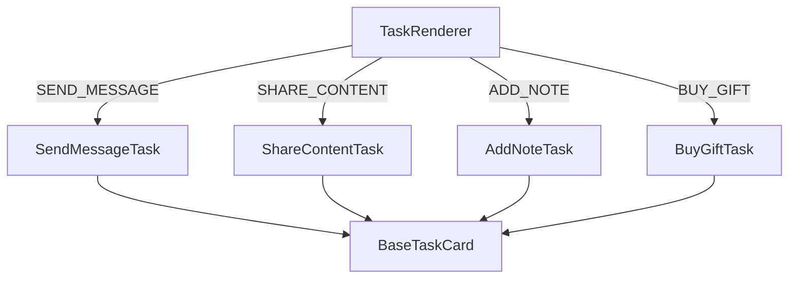
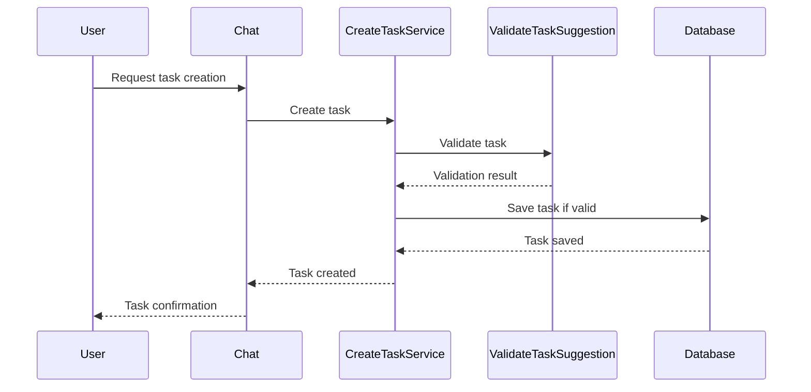
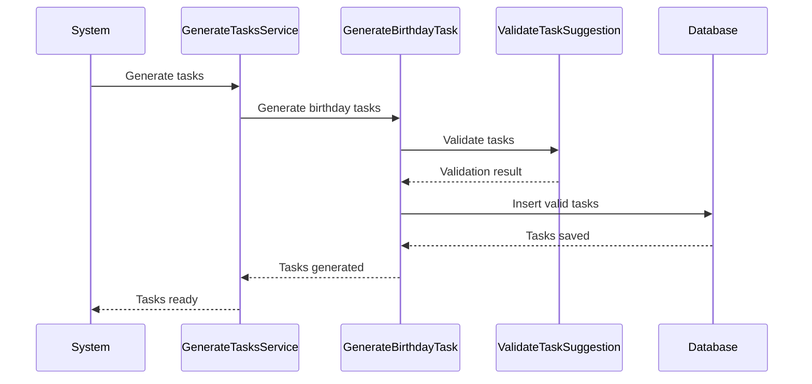
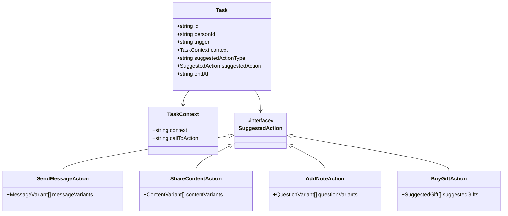
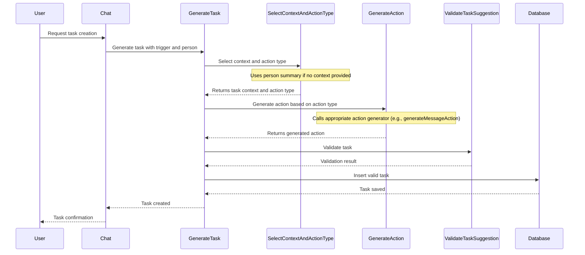

# Task Service Architecture Overview

## Component Structure

The task system follows a component-based architecture with a base task card that specialized task components inherit from:

1. **BaseTaskCard**: The foundation component that provides common UI elements and functionality for all task types.
2. **Specialized Task Components**: Components that extend BaseTaskCard for specific action types:
   - ShareContentTask
   - BuyGiftTask
   - SendMessageTask
   - AddNoteTask

## Task Rendering Flow

The TaskRenderer component determines which specialized task component to render based on the task's suggestedActionType:



## Task Creation Flow

Tasks can be created in two ways:

1. **User-Requested Tasks**: Through the chat mechanism
2. **System-Generated Tasks**: Automatically generated based on triggers



## Task Generation Flow

The system can automatically generate tasks based on various triggers:



## Task Data Model

Tasks have the following key components:

1. **Trigger**: What caused the task to be generated (birthday, user request, etc.)
2. **Context**: Information about the task and the person it's associated with
3. **SuggestedActionType**: The type of action to take (send message, share content, etc.)
4. **SuggestedAction**: The specific action details based on the action type



## Extending the Task System

To add a new action type to the system, you need to update the following files:

1. **Constants**: Add the new action type to `src/lib/tasks/constants.ts`

   ```typescript
   export const SUGGESTED_ACTION_TYPES = {
     // existing types
     NEW_ACTION_TYPE: 'new-action-type'
   };
   ```

2. **Types**: Add the new action schema to `src/services/tasks/types.ts`

   ```typescript
   export const newActionSchema = z.object({
     // action-specific fields
   });

   // Update the taskSuggestionSchema to include the new action type
   export const taskSuggestionSchema = z.object({
     // existing fields
     suggestedAction: z.union([
       // existing schemas
       newActionSchema
     ])
   });
   ```

3. **Validation**: Update `src/services/tasks/validate-task-suggestion.ts` to validate the new action type

   ```typescript
   // In the validateTaskSuggestion function
   switch (suggestedActionType) {
     // existing cases
     case SUGGESTED_ACTION_TYPES.NEW_ACTION_TYPE:
       newActionSchema.parse(suggestedAction);
       break;
   }
   ```

4. **Component**: Create a new task component in `src/components/tasks/`

   ```typescript
   // new-action-task.tsx
   import { BaseTaskCard } from './base-task-card';
   import { GetTaskSuggestionResult } from '@/services/tasks/types';

   export const NewActionTask = ({ task }: { task: GetTaskSuggestionResult }) => {
     // Implementation
     return (
       <BaseTaskCard
         task={task}
         actionBody={<NewActionCardActionBody action={task.suggestedAction} />}
       />
     );
   };
   ```

5. **Task Renderer**: Update `src/components/tasks/task-renderer.tsx` to render the new task type

   ```typescript
   import { NewActionTask } from './new-action-task';

   // In the TaskRenderer component
   switch (task.suggestedActionType) {
     // existing cases
     case SUGGESTED_ACTION_TYPES.NEW_ACTION_TYPE:
       return <NewActionTask task={task} />;
   }
   ```

6. **Generation**: If the system should automatically generate this type of task, update the task generation services

   ```typescript
   // In generate-tasks.ts or a new file in generate-tasks/
   export async function generateNewActionTasks(db: DBClient, userId: string) {
     // Implementation
   }
   ```

7. **Integration with Other Services**: If the new action type requires integration with other services (like suggestions, calendar, or email), create the necessary service methods and update the task generation logic to use them.

## Integration with External Services

The task system can integrate with various external services:

1. **Suggestions Service**: For generating content suggestions for the SHARE_CONTENT action type
2. **Calendar Service**: For scheduling tasks or checking availability
3. **Email Service**: For sending emails as part of task actions

To integrate with a new external service:

1. Create the service methods in the appropriate service directory
2. Update the task generation logic to use the new service
3. Update the task validation to ensure the service integration works correctly

## Conclusion

The task service architecture is designed to be extensible, allowing for new action types and integrations with external services. By following the patterns established in the codebase, you can easily add new functionality while maintaining consistency and reliability.

The key to extending the system is understanding the flow of data from task creation to rendering, and ensuring that all necessary components are updated to support the new functionality.

## Proposed Enhanced Task Generation Flow

The following diagram illustrates a proposed enhanced task generation flow that standardizes the process for both user-requested and system-generated tasks:



This enhanced flow provides several benefits:

1. **Standardized Process**: Both user-requested and system-generated tasks follow the same generation flow.

2. **Separation of Concerns**:

   - `SelectContextAndActionType` determines what action to take based on the context
   - `GenerateAction` creates the specific action content
   - `GenerateTask` orchestrates the process and handles persistence

3. **Extensibility**: Adding new action types only requires:

   - Adding a new action type to the constants
   - Creating a new action generator
   - Registering the action generator with the `GenerateAction` service

4. **Improved AI Integration**: The AI-generated content is clearly separated into the `GenerateAction` step, making it easier to enhance or modify.

5. **Consistent Validation**: All tasks go through the same validation process before being saved to the database.

This approach would make the task system more maintainable and easier to extend with new action types in the future.
